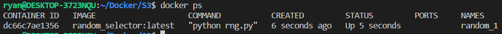

# Introduction to Docker

## What is Docker?

- A tool that creates and manages containers.
  - What is **container**?
    - A standardized software unit.
    - A set of codes and their dependencies
      - e.g) Node.js + React
- Why do we use containers?
  - Reproducity !
  - Convinence !

## VM(Virtual Machine) vs Container?

- VM: Installing things on Virtual OS in our OS.

  - Good for reproducing and sharing separated / environment-specific configurations.
  - For each project, we need each individual VMs. - A lot waste of spaces ! (Drive, CPU, RAM ... that are mostly used from running Virtual OS)

- Container: Running docker engine on OS built-in or emulated container support.
  - Each container(as project) doesn't require Virtual OS !
  - Can build a container as an image !
  - Economic !

## Image and Containers

- Image: Contains app code & environment
- Container: Running such app.

## Basic Usage

- Write `Dockerfile`

```docker
FROM node:14

# Each container has own working directory
WORKDIR /app

# Copy package.json to the root of container.
COPY package.json .

# Run command
RUN npm install

# Copy other files to the root of container.
COPY . .

# Specify the exposed port (Depend on the implementation)
EXPOSE 3000

# Run command
# RUN: For running in the image inside the container
# CMD: For running in the host. (When container start to run.)
CMD [ "node", "app.mjs"]
```

- Build container

  - `docker build .`

- Run image

  - `docker run -p 3000:3000 de8491e2b1a6`
    - `-p [SRC_PORT]:[DEST_PORT]`

- Useful command

  - `docker ps` : Show all running containers.
    - `-a` : Show all containers including ones that had been launched before
  - `docker start [CONTAINER]` : Start and resume stopped containers.
    - `-a` : Start with **attached** mode.
  - `docker images` : Show all images.
  - `docker stop [NAME]` : Kill the designated container.

- Docker image is just a snapshot of that moment.

  - Further changes in code are not automatically applied. (Images are read-only !)
  - If wanna do so, re-build it. (We further discover version controlling)

    - When re-building, they uses cached data to reduce working time.
      - Cause docker is `Layer-based architecture !`
    - To optimize image creation latency, compositing the procedure is important.

```docker
# The base image `node` is from Dockerhub.

FROM node

WORKDIR /app

COPY package.json /app

# If there are no changes in package.json, Docker ignores this command.

RUN npm install

# And only if copies the other changed files.

COPY . /app

EXPOSE 80

# RUN: For running in the image inside the container

# CMD: For running in the host. (When container start to run.)

CMD ["node", "server.js"]

```

## Attached & Detached

- Command `docker run` with a flag `-d` runs a container in **Detached** mode.

  - Which don't use its console prompt.
  - If want to attach it: `docker container attach [CONTAINER_NAME]`

- `docker logs [CONTAINER_NAME]` puts all I/O history of the container.
  - If use `-f` flag (Following mode), it consistently receives upconimg outputs.

## Running in Interactive Mode

- Docker container cannot interact in default.

  - use `-i` flag with `docker run` to open `STDIN` (Standard Input)
  - use `-t` flag with `docker run` to allocate a pseudo-TTY

- e.g) `docker run -i -t [Image Name]`

- For resuming stopped containers,

  - use `-i` flag with `docker start -a` to open `STDIN`

## Deleting Image & Containers

- Container

  - `docker rm [CONTAINER_NAME]`: Remove the designated container
  - `docker container prune`: Remove all stopped container

- Image
  - `docker image remove [IMAGE_NAME]` or shortcut `docker rmi [IMAGE_NAME]`
  - Can also use `docker image prune` to remove all unused images.

## Copy files to containers or from containers

- Can be used for applying source changes and adding some data(such as configurations, dataset) without re-building or restarting image/containers.
  - `docker cp [SRC_HOST] [DEST_CONTAINER:PATH]`: From host to container
  - `docker cp [SRC_CONTAINER:PATH] [DEST_HOST]`: From container to host

## Adding name and tags



- When running
  - Container name: Use `--name [CONTAINER_NAME]` flag with `docker run`
  - Image `[IMAGE_NAME]:[IMAGE_TAG]`
    - Use `-t(--tag) [IMAGE_NAME]:[IMAGE_TAG]` flag with `docker build`

## Sharing Images & Containers

- To `Docker Hub` or `Private Registry`

## Data Management

- `Image`: Storing pernament data - such as codes or fixed things of an application
- `Container`: Storing temporal data - such as user inputs, and the things don't need to be stored pernamently.
- `Volume`: Pernament app data - such as database produced in container.

- How can we keep certain files regadless container is detached or removed?
  - Use `Volume`: **Folders on the host machine**
    - Connecting a folder of host machine to the folder inside container.

### Making Volume

- Define in `Dockerfile`

  ```Docker
  VOLUME ["TARGET_FOLDER_IN_CONTAINER"]
  ```

- Anonymous Volumes
  - Automatically matched somewhere we don't know by Docker.
  - Automatically removed when the container is stopped.
- Named Volumes
  - Explictly matched **known folders** we know.
  - **Keep the folder regardless the container is stopped.**
